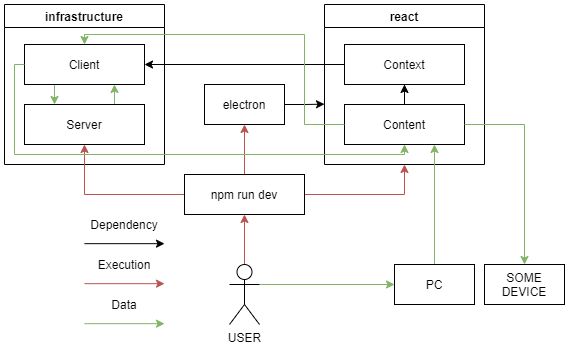

# Stash
A client-server application that allows you to share and download images between devices in your local network.

**Also check:**

[Android Compose image sharing client](https://github.com/numq/Stash)



## Launch:
```
npm run dev
```

## Tech:
- JavaScript
- React
- Bootstrap
- Electron
- WebSockets
- JSZip
- QRCode
- FileSaver
